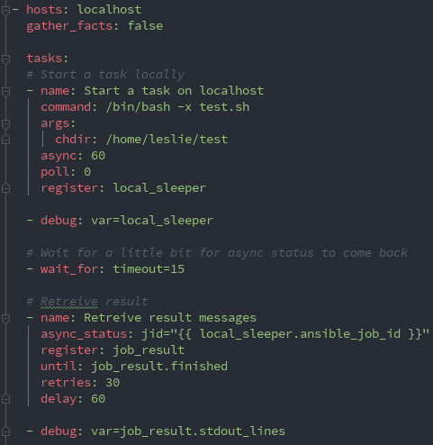

# Modules - 全部模块

## 目录

- [Modules - 全部模块](#modules---全部模块)
  - [目录](#目录)
  - [常用模块总览](#常用模块总览)
  - [command](#command)
  - [copy](#copy)
  - [debug](#debug)
  - [file](#file)
    - [创建权限和设置软连接](#创建权限和设置软连接)
    - [使用变量](#使用变量)
    - [创建文件和文件夹](#创建文件和文件夹)
  - [service](#service)
  - [shell](#shell)
  - [template](#template)
  - [user](#user)
  - [yum](#yum)
  - [async](#async)

---

## 常用模块总览

- 调试和测试类的模块
    - ping 测试远程主机连通性
    - debug 调试模块,打印一些简单的消息
- 文件类的模块
    - copy 从本地复制文件到远程节点
    - template 从本地复制文件到远程节点,并进行变量的替换。
    - file 设置文件属性
- Linux 上的常用操作
    - user: 管理用户账户
    - yum: 安装软件包
    - service: 管理服务
    - firewalld 管理防火墙
- 执行 shell 命令
    - shell: 在节点上执行 shell 命令,支持 `$HOME`、`"<"`、`">"`、`"|"`、`";"` 和 `"&"`
    - command: 在远程节点上面执行命令,不支持 `$HOME`、`"<"`、`">"`、`"|"`、`";"` 和 `"&"`

---

## command

```yaml
---
- hosts: bj-web

  tasks:
    - name: return motd to registered var
      command: '/bin/date'
      register: test_var

    - name: print test_var
      debug:
        var: test_var
```

---

## copy

```yaml
---
- hosts: bj-web

  tasks:
    - name: test copy file
      copy:
        src: /tmp/leslie
        dest: /home/leslie/qikang
        owner: leslie
        group: leslie
        mode: 0700
```

如果只是复制文件 copy 就可以了,如果需要修改需要文件的内容,需要使用 template 模块。

---

## debug

debug 模块。

打印动态注入的环境变量。

```yaml
- name: Print debug infomation eg
  hosts: bj-db

  tasks:
    - name: Command run line
      shell: uptime
      register: result

    - name: Show debug info
      debug: var=result.stdout verbosity=0
```

---

## file

参考文档: <https://docs.ansible.com/ansible/2.5/modules/file_module.html#file-module>

设置远程主机上的文件、软连接和文件夹权限,也可以创建和删除它们。

### 创建权限和设置软连接

```yaml
---
- hosts: bj-web

  tasks:
    - name: test file module
      file:
        src: /home/leslie/qikang
        dest: /home/leslie/qikang-link
        owner: leslie
        group: leslie
        mode: 0607
        state: link
```

### 使用变量

```yaml
---
- hosts: bj-web

  vars:
    test_var: "__leslie__"

  tasks:
    - name: test file module
      file:
        src: /home/leslie/qikang
        dest: /home/leslie/qika{{ test_var }}nk
        owner: leslie
        group: leslie
        mode: 0607
        state: link
```

### 创建文件和文件夹

```yaml
---
- hosts: bj-web

  vars:
    test_var: "__leslie__"

  tasks:
    - name: test file module
      file:
        src: /home/leslie/qikang
        dest: /home/leslie/qika{{ test_var }}nk
        owner: leslie
        group: leslie
        mode: 0607
        state: link

    - name: create new file
      file:
        path: /tmp/foo.conf
        state: touch
        mode: 'u=rwx,g=r,o=r'

    - name: create new directory
      file:
        path: /tmp/foo_dir
        state: directory
        mode: 0755
```

---

## service

```yaml
---
- hosts: sg-entry

  vars:
    http_port: 8000
    max_clients: 3
  remote_user: leslie

  tasks:
    - name: ensure httpd is started.
      service: httpd
      state: restarted
```

---

## shell

```yaml
---
- hosts: sg-entry
  remote_user: leslie

  tasks:
    - name: test shell command.
      shell: pwd > /tmp/leslie && id >> /tmp/leslie
```

---

## template

```yaml
---
- hosts: bj-web

  vars:
    http_name: 'test_name'

  tasks:
    - name: test template module
      template:
        src: /tmp/leslie
        dest: /home/leslie/qikang
        owner: leslie
        group: leslie
        mode: 0700
        backup: yes
      validate: 'cat %s'
```

在 `/tmp/leslie` 文件中直接使用 `{{ ansible_default_ipv4.address }}` `{{ http_name }}` `{{ ansible_hostname }}` 变量。

---

## user

```yaml
---
- hosts: bj-web

  tasks:
    - name: test user modules
      user:
        name: johnd
        comment: 'John Doe'
        append: yes
        groups: johnd,ec2-user
        uid: 10400

    - user:
        name: jsmith
        generate_ssh_key: yes
        ssh_key_bits: 2048
        ssh_key_file: .ssh/jsmith_key
```

---

## yum

```yaml
---
- hosts: sg-entry

  vars:
    http_port: 8000
    max_clients: 3
  remote_user: leslie

  tasks:
    - name: 'install @Development tools'
      yum:
        name: "@Development tools"
      state: persent
```

## async

